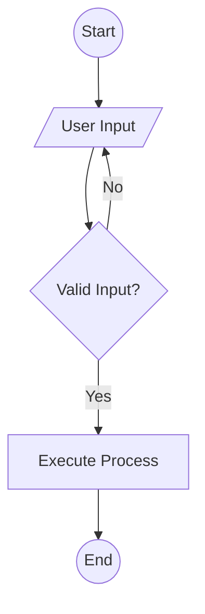
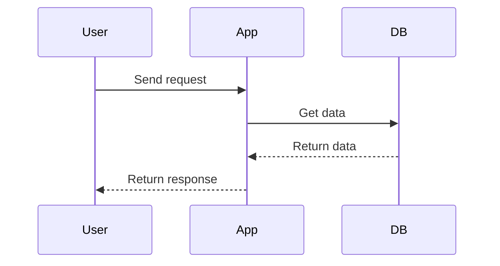
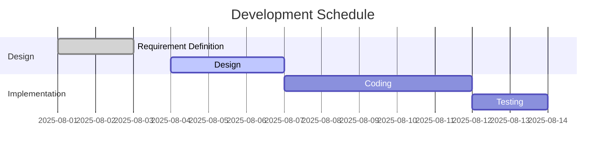

---
# aaaa
adasds
---

# Typora Theme Test Document

This document is a test file for checking the appearance of Typora themes.
## Natural Language Display Test

### English
The quick brown fox jumps over the lazy dog.  
Pack my box with five dozen liquor jugs.

### Japanese
素早い茶色の狐が怠け者の犬を飛び越える。  
いろはにほへと ちりぬるを。

### Chinese (Simplified)
快速的棕色狐狸跳过了懒狗。  
今天天气很好。

### Korean
빠른 갈색 여우가 게으른 개를 뛰어넘는다.  
안녕하세요. 좋은 하루 되세요.

### French
Le vif renard brun saute par-dessus le chien paresseux.  
Bonjour, comment ça va ?

### German
Falsches Üben von Xylophonmusik quält jeden größeren Zwerg.  
Guten Morgen! Wie geht's?

### Spanish
El rápido zorro marrón salta sobre el perro perezoso.  
¡Hola! ¿Cómo estás?

### Russian
Быстрая коричневая лисица перепрыгивает через ленивую собаку.  
Привет! Как дела?

### Arabic
الثعلب البني السريع يقفز فوق الكلب الكسول.  
مرحبًا! كيف حالك؟

### Hindi
तेज़ भूरी लोमड़ी आलसी कुत्ते के ऊपर कूदती है।  
नमस्ते! आप कैसे हैं?


## Heading Test

### H3 Heading
#### H4 Heading
##### H5 Heading
###### H6 Heading

## Text Styles

**Bold text** and *italic text* display check.

~~Strikethrough text~~ and `inline code` display check.

## Lists

### Unordered List
- Item 1
- Item 2
  - Nested Item 1
  - Nested Item 2
    - Further Nested Item
- Item 3

### Ordered List
1. First item
2. Second item
   1. Nested item
   2. Another nested item
3. Third item

### Task List
- [x] Completed task
- [ ] Incomplete task
- [ ] Another incomplete task

## Code Blocks


### JavaScript
```javascript
// Function declaration
function greetUser(name) {
  if (!name) {
    throw new Error('Name is required');
  }
  let message = `Hello, ${name}!`;
  for (let i = 0; i < 3; i++) {
    console.log(message + ' (' + i + ')');
  }
  return true;
}

// Object and array
const user = {
  name: "Developer",
  skills: ["JS", "CSS", "HTML"],
  active: true
};

// Arrow function
const getSkillList = (user) => user.skills.join(", ");

// Execute
greetUser(user.name);
console.log(getSkillList(user));
```

### Python
```python
import math
from typing import List

def calculate_sum(a: int, b: int) -> int:
  """Function to calculate the sum of two numbers"""
  result = a + b
  print(f"Calculation: {a} + {b} = {result}")
  return result

def factorial(n):
  if n == 0:
    return 1
  else:
    return n * factorial(n-1)

class User:
  def __init__(self, name: str, scores: List[int]):
    self.name = name
    self.scores = scores
  def average(self):
    return sum(self.scores) / len(self.scores)

# Example usage
num1 = 10
num2 = 20
total = calculate_sum(num1, num2)
print(f"Sum: {total}")
print(f"Factorial of 5: {factorial(5)}")
user = User("Sabiz", [80, 90, 100])
print(f"Average score of {user.name}: {user.average()}")
```

### CSS
```css
.theme-test {
    color: var(--primary-color);
    background: linear-gradient(45deg, #ff6b6b, #4ecdc4);
    padding: 1rem 2rem;
    border-radius: 8px;
    box-shadow: 0 4px 6px rgba(0, 0, 0, 0.1);
    transition: background 0.3s, color 0.3s;
}
.theme-test:hover {
    background: linear-gradient(90deg, #4ecdc4, #ff6b6b);
    color: #fff;
}
@media (max-width: 600px) {
    .theme-test {
        padding: 0.5rem;
        font-size: 0.9em;
    }
}
```

### SQL
```sql
-- Get user information
SELECT id, name, age, created_at
FROM users
WHERE age > 20 AND status = 'active'
ORDER BY created_at DESC
LIMIT 10;

-- Create table
CREATE TABLE IF NOT EXISTS logs (
  id SERIAL PRIMARY KEY,
  message TEXT NOT NULL,
  created_at TIMESTAMP DEFAULT CURRENT_TIMESTAMP
);
```

### HTML
```html
<!DOCTYPE html>
<html lang="en">
<head>
  <meta charset="UTF-8">
  <title>HTML Sample</title>
</head>
<body>
  <section id="main">
    <h2>HTML Sample</h2>
    <p>This is an HTML code block.</p>
    <ul>
      <li>List 1</li>
      <li>List 2</li>
    </ul>
    <a href="#">Link</a>
  </section>
</body>
</html>
```

### YAML
```yaml
version: '3.8'
services:
  web:
    image: nginx:latest
    ports:
      - "8080:80"
    environment:
      - NGINX_HOST=localhost
      - NGINX_PORT=80
  db:
    image: postgres:13
    restart: always
    environment:
      POSTGRES_PASSWORD: example
```

### R
```r
# Vectors and mean
data <- c(1,2,3,4,5)
print(mean(data))

# Function definition
square <- function(x) {
  return(x^2)
}
print(square(4))

# Plotting
plot(data, type="l", col="blue", main="Line Plot")
```

### Haskell
```haskell
-- Factorial function
factorial 0 = 1
factorial n = n * factorial (n - 1)

-- List comprehension
squares = [x*x | x <- [1..10]]

-- Recursive Fibonacci
fibonacci 0 = 0
fibonacci 1 = 1
fibonacci n = fibonacci (n-1) + fibonacci (n-2)
```

### Swift
```swift
import Foundation

let greeting = "Hello, Swift!"
let numbers = [1, 2, 3, 4, 5]

func sum(_ arr: [Int]) -> Int {
  return arr.reduce(0, +)
}

print(greeting)
print("Sum: \(sum(numbers))")
```

### PowerShell
```powershell
# List of services and their status
Get-Service | Where-Object { $_.Status -eq 'Running' } | Select-Object -First 5

# Check if file exists
if (Test-Path ".\test.txt") {
  Write-Output "File exists"
} else {
  Write-Output "File does not exist"
}
```

### Perl
```perl
# Array and hash
my @nums = (1, 2, 3, 4, 5);
my %user = (name => 'Sabiz', age => 30);

foreach my $n (@nums) {
  print "$n ";
}
print "\n";

while (my ($k, $v) = each %user) {
  print "$k: $v\n";
}
```

### Lisp
```lisp
;; Recursion and list operations
(defun factorial (n)
  (if (<= n 1) 1 (* n (factorial (- n 1)))))

(defun map-square (lst)
  (mapcar #'(lambda (x) (* x x)) lst))

(print (map-square '(1 2 3 4 5)))
```

### Rust
```rust
fn factorial(n: u32) -> u32 {
  match n {
    0 | 1 => 1,
    _ => n * factorial(n - 1),
  }
}

fn main() {
  let nums = [1, 2, 3, 4, 5];
  for n in nums.iter() {
    println!("Factorial of {}: {}", n, factorial(*n));
  }
}
```

### Mermaid (Flowchart)


### Mermaid (Sequence Diagram)


### Mermaid (Gantt Chart)


## Table

| Item | Description | Price |
|------|-------------|-------|
| Product A | High quality product | ¥1,000 |
| Product B | Cost performance focused | ¥500 |
| Product C | Premium product | ¥2,000 |

## Blockquote

> This is a blockquote. Use it to quote important information or someone else's words.
> 
> Multi-line blockquotes are also possible.

> ### Heading in Blockquote
> You can include headings inside blockquotes.

## Links

[GitHub](https://github.com) external link

[Internal link](#heading-test) to move within the document

## Image


## Horizontal Rule

---

## Math (LaTeX)

Inline math: $E = mc^2$

Block math:
$$
\sum_{i=1}^{n} x_i = x_1 + x_2 + \cdots + x_n
$$

## Emoji

🎨 Theme Design 🚀 Performance ✅ Complete

## Footnote

This is a text with a footnote[^1].

[^1]: This is the content of the footnote.

## Details (Collapsible)

<details>
<summary>Show details</summary>

Detailed content is shown here.

- Detail item 1
- Detail item 2
- Detail item 3

</details>

## Highlight

Check display of ==highlighted text==.

## Superscript & Subscript

Markdown: H~2~O and X^2^  
HTML tags: H<sub>2</sub>O and X<sup>2</sup>

Complex example: **Note:** C~n~H~2n+2~ is an alkane, E=mc^2^ is a famous formula from relativity.


## Additional Pattern Test

### Nested Blockquote, List, and Code
> Outer blockquote
> > Inner blockquote
> > - List 1
> >   - Sublist
> >     1. Numbered
> >         ```js
> >         // Nested code
> >         console.log('nested');
> >         ```

### HTML Tag Test
<div style="border:1px solid #ccc;padding:8px;">div tag test <span style="color:red;">span tag</span> <mark>mark tag</mark> <sup>sup</sup> <sub>sub</sub> <ruby>Kan<rt>kan</rt>ji<rt>ji</rt></ruby> <kbd>Ctrl+C</kbd> <abbr title="Abbreviation">abbr</abbr></div>

<table>
  <tr><th>HTML Table</th><th>Test</th></tr>
  <tr><td>Cell 1</td><td>Cell 2</td></tr>
</table>

<details open>
<summary>HTML Collapsible</summary>
<p>HTML details/summary test</p>
</details>

<center>center tag test</center>
<right>right tag test</right>
<left>left tag test</left>

<hr>
<br>

### Consecutive Horizontal Rules
---
---
---

### Consecutive Images
  

### Consecutive Links
[Google](https://google.com) [Yahoo](https://yahoo.co.jp) [Bing](https://bing.com)

### Consecutive Footnotes
Footnote A[^a] Footnote B[^b] Footnote C[^c]

[^a]: Content of footnote A
[^b]: Content of footnote B
[^c]: Content of footnote C

### Consecutive LaTeX Math
$a^2+b^2=c^2$ $\int_0^1 x^2 dx$ $\frac{1}{2}$

### Consecutive Highlights
==A== ==B== ==C==

### Consecutive Task List
- [ ] A
- [x] B
- [ ] C

### Consecutive Tables
|A|B|C|
|-|-|-|
|1|2|3|
|4|5|6|

|X|Y|
|-|-|
|a|b|

### Consecutive Inline Code
`code1` `code2` `code3`

### Consecutive Emphasis, Italic, Strikethrough, Underline, Insert
**bold1** *italic1* ~~del1~~ __underline1__ ++ins1++
**bold2** *italic2* ~~del2~~ __underline2__ ++ins2++

### Consecutive Blank Lines / Line Breaks


Text A  
Text B  
Text C

### Consecutive Long Text
Lorem ipsum dolor sit amet, consectetur adipiscing elit. Pellentesque euismod, nisi eu consectetur consectetur, nisl nisi consectetur nisi, euismod euismod nisi nisi euismod.
Lorem ipsum dolor sit amet, consectetur adipiscing elit. Pellentesque euismod, nisi eu consectetur consectetur, nisl nisi consectetur nisi, euismod euismod nisi nisi euismod.

### Consecutive Deep Nesting
1. A
   - B
     1. C
        - D
          1. E
             > F
               - G
                 ```python
                 print('deep nest')
                 ```

### Consecutive Collapsible
<details><summary>Collapsible 1</summary>Content 1</details>
<details><summary>Collapsible 2</summary>Content 2</details>

### Consecutive Emoji
😀 😃 😄 😁 😆 😅 😂 🤣 😊 😇

### Consecutive HTML Comments
<!-- Comment 1 --><!-- Comment 2 --><!-- Comment 3 -->

### Consecutive Special Characters
& < > " ' ` ~ ^ | \ / # % $ @ ! ? * ( ) [ ] { } : ; , . _ + = -
     > Quoted text
   - Subitem 2
     ```bash
     echo "Code block"
     ```

2. **Main Category 2**
   - [ ] Task 1
   - [x] Completed task
   - Subitem
     - Further nested item

